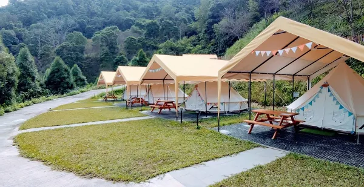

# Taiwan Campground Website: A Simple Small Project



## Setting up the Environment for windows
To set up your sql environment

### Setting up the SQL server
#### Step 1. Download the docker desktop for windows
https://www.docker.com/products/docker-desktop/

#### Step 2. Pull the Microsoft SQL server container
```shell
docker pull mcr.microsoft.com/mssql/server:2022-latest
```
#### Step 3. run the docker container
```shell
docker run -e "ACCEPT_EULA=Y" -e "MSSQL_SA_PASSWORD=<YourStrong@Passw0rd>" -p 1433:1433 --name sql1 --hostname sql1 -d mcr.microsoft.com/mssql/server:2022-latest
```
if you see the image then you are success run the SQL server!

### Setting up the backend server
#### step1.
```shell
git clone 
```
#### step2. install node.js
https://nodejs.org/en
#### step3 download the dependence and module
`cd ` into the directory from GitHub.
```shell
npm install
```
#### step4. run the server
```shell
node ./index.js
```
### Create DataBase and insert some data

**Authors:**
* Sean_Lin(kirbeee) S10350313@thu.edu.tw
